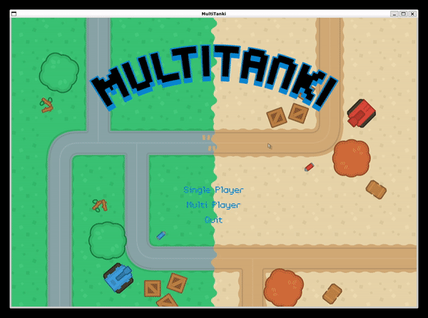

# SoftSysMultiTanki

MultiTanki is a multiplayer game written in C using SDL2. It is inspired by the Tanks! game from the Wii Play, but unlike the Tanks! it is fully made of top-down 2D graphics instead of 3D. It communicates through a simple UDP P2P connection between computers to achieve the multiplayer feature.

## Demo

[Single Play](https://youtu.be/H5mSYYUEZL0)

## Building

To install dependencies on Ubuntu:

    $ sudo apt-get install libsdl2-dev
    $ sudo apt-get install libsdl2-image-dev
    $ sudo apt-get install libsdl2-mixer-dev
    $ sudo apt-get install libsdl2-ttf-dev

To compile:

    $ make

To run:

    $ ./multitanki

## Instructions

* <kbd>w</kbd> <kbd>a</kbd> <kbd>s</kbd> <kbd>d</kbd> : Move the tank/cursor
* <kbd>Left Mouse Button</kbd> : Shoot bullet to current cursor position
* <kbd>SPACE</kbd> : Select on title/gameover screen

## Known Issues

- If no sound plays or there is a big delay, try launching the game again
- The reset function is not implemented yet, so re-starting the game after a game over will cause memory leak
