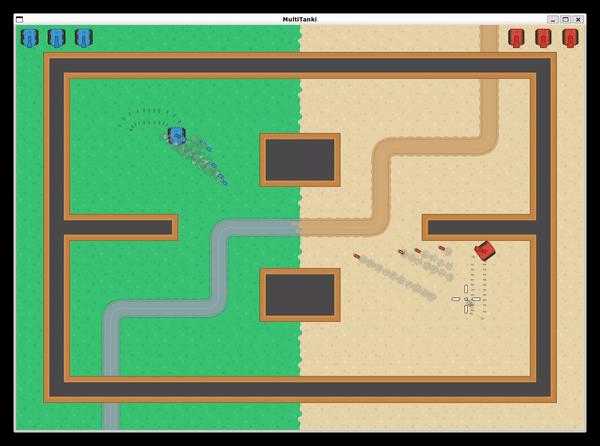

# MultiTanki
> Melissa Kazazic and SeungU Lyu

## Goals

We aim to create a multiplayer game like the [Wii Tanks](https://youtu.be/orLxrg51xL8) where each players can connect to the same session on their own computers. Unlike the link, we aim to create the game fully top-down 2D. 

### MVP

The game will have similar mechanics as Wii Tanks, with the ability to move the tank (with either keyboard input or mouse tracking), aim the shots, and kill the enemy with the collision detection. The game will be multiplayer, joining the session from separate computers. The MVP version of the game will be done with minimal graphics, not including extra details like effects or animations.

### Stretch Goal

The first stretch goal would be to have the shells bounce off the walls from the angle where it was originally shot from. Along with the working multiplayer tank game, we would like to apply random map generation. This is so that every time the game is started, new maps would show up, creating new fun experiences. Then, we would also like to apply extra explosion effects, graphics, music, sound effects, etc., so that we can create a full game if we can.

## Individual Learning Goals

### Melissa

- Learn how to make a game in C
- Learn how to get multiplayer connection for said game in C
- Learn how to do graphics in C (+ incl. libraries)

### SeungU

- Learn how to use libraries to build a game in C
- Learn how to implement multiplayer feature
- If possible, learn about algorithms behind random-map generation and implement it

## Getting Started

### Resources

#### General Design

- [Wii Tanks](https://youtu.be/orLxrg51xL8)
- [Kenney Free Assets](https://www.kenney.nl/assets)

#### Multiplayer

- Head First C, Chapter 11: Sockets and networking
- Computer Systems, A Programmer's Perspective Chapter 11: Network Programming
- [GeeksforGeeks Socket Programming in C](https://www.geeksforgeeks.org/socket-programming-cc/)
- [GeeksforGeeks Example for fork and pipe](https://www.geeksforgeeks.org/c-program-demonstrate-fork-and-pipe/)
- [IBM's C Socket Documentation](https://www.ibm.com/docs/en/zos/2.3.0?topic=interfaces-c-socket-application-programming-interface)

#### SDL

- [SDL Tutorials](http://wiki.libsdl.org/Tutorials)
- [SDL2 Game Tutorials](https://www.parallelrealities.co.uk/tutorials/)
- [Probably Worth Buying](https://parallelrealities.itch.io/sdl2-tutorials)
- [SDL 2.0 API by Category](https://wiki.libsdl.org/APIByCategory)

## Result

[Demo video]()

The game is done with most of the MVP and the stretch goals. We were able to finish the game by creating features like moving tanks, shooting bullets, and collision detections. We were also able to add a lot of extra features such as bullets bouncing off the walls from the angle, explosion effects, trail effects, graphics, music, sound effects, etc. On the single-player side, the player can compete against 3 different AIs to defeat them all and achieve victory. On the multi-player side, we were able to create a session where each player is assigned to a different index and controls different tanks. We are currently working on sending and receiving player input data so that 2 people can compete with each other very soon. 

## Design Choices

### Single-Player Game
*SeungU*

1. Bullet collision was the part that took the most time and consideration. It was easy to determine whether the bullet hit the wall or not because we knew the coordinates of the wall's corners, and also knew the coordinates of the bullet's corners. This means that we can just check if two rectangles overlap, or check if a certain point of the bullet is inside the wall's rectangle. The issue was that we wanted the bullet to reflect when it hits the wall - which means that we have to know "how" the bullet hit the wall, instead of just checking the collision status.

    This was done by creating a vector that connects the bullet's center and the tip of its head, and checking if it is intersecting with each side of the walls. [This code](https://github.com/olincollege/SoftSysMultiTanki/blob/2750cf19702e22c5b6ff0ba06ba1e989466c8ab9/src/modified/util.c#L66) shows how the math is done to check the intersection. The collision detection happens in [this code](https://github.com/olincollege/SoftSysMultiTanki/blob/2750cf19702e22c5b6ff0ba06ba1e989466c8ab9/src/original/collision.c#L46), where you can see that collision between 4 different sides of walls happen sequentially until a collision is detected. After collision detection, [this code](https://github.com/olincollege/SoftSysMultiTanki/blob/2750cf19702e22c5b6ff0ba06ba1e989466c8ab9/src/modified/util.c#L109) calculates the reflected angle according to the axis, and change the bullet's trajectory.
    
    One issue with this algorithm was that in a low framerate, the bullet vector goes through two walls at the same time, creating unexpected behavior where the bullet reflects toward the inner side of the wall. To prevent this, a [new math function](https://github.com/olincollege/SoftSysMultiTanki/blob/2750cf19702e22c5b6ff0ba06ba1e989466c8ab9/src/modified/util.c#L163) to check if bullet's center is located inside the wall's rectangle is introduced and will  [destroy the bullet](https://github.com/olincollege/SoftSysMultiTanki/blob/2750cf19702e22c5b6ff0ba06ba1e989466c8ab9/src/original/collision.c#L79) if the condition is true. This will delete the bullet without it getting the maximum amount of reflection, but it was not noticeable. 

    There could've been better ways to deal with this problem, but by far the current algorithm works well without any lag in frames.

2. Effects in general were pretty hard to implement. The issue was that number of effects in the game changes dynamically, meaning that the size of the data structure that holds the effects have to change in real-time. This was done by creating a linked-list struct called [Effect](https://github.com/olincollege/SoftSysMultiTanki/blob/2750cf19702e22c5b6ff0ba06ba1e989466c8ab9/src/structs.h#L26). The struct has a pointer to the next struct, meaning that we were able to iterate through the list whenever we needed to.

    Effects were mainly used to show the tank's trail or the bullet's trail. [Tank's trail](https://github.com/olincollege/SoftSysMultiTanki/blob/2750cf19702e22c5b6ff0ba06ba1e989466c8ab9/src/original/effect.c#L34) will be created every time the tank moves a certain distance and will stay there permanently. [Bullet's trail](https://github.com/olincollege/SoftSysMultiTanki/blob/2750cf19702e22c5b6ff0ba06ba1e989466c8ab9/src/original/effect.c#L87) will also be created every time the bullet moves a certain distance, but it [will disappear](https://github.com/olincollege/SoftSysMultiTanki/blob/2750cf19702e22c5b6ff0ba06ba1e989466c8ab9/src/original/effect.c#L213) once it stayed for a certain amount of time. One common thing is that the new Effect's pointer will attach to the tail of the linked list, and also keeps the linked-list structure even when one effect disappears, making it possible for us to adjust the data size in real-time.

    

    The above image shows how the combination of the above design choices creates a cool scene where bullets and tanks leave trails, and the bullet reflects when it hits a wall.

### Multiplayer P2P UDP Connection
*Melissa*

1. **UDP**: For the network protocol between the two players, we needed something that was fast. In comparison to TCP, where UDP lacks in keeping integrity of packets and error checking ("handshake protocol" that TCP has), it gains in speed, which is important for an online game. Online games use UDP, due to this speed and flexibility as it is connectionless. So, we decided on using User Datagram Protocol.

2. **P2P**: Next, we needed to figure out how the two players will communicate to each other. Peer-to-peer seemed ideal. Like with the decision for UDP, we want a connection that is fast and reliable. This decision was also based on how online games often go about this - for example, Destiny 2 uses a hybrid of server/client and peer to peer, with the server with environment information and peer to peer for individual user activity.

3. **Matchmaking**: Before connecting the two players to each other, there needs to be a way that they can get information from each other. Given the decisions for P2P and UDP, we need both the ip address of the other player, the port, and their tank numbers. To solve for the port number, both the player and peer port numbers are set to be an arbitrary usable port (we used `7777`). That was just one issue out of the way, but there still needs to be a way to get the player's ip address to each other as well as being assigned their tank numbers. 

    From the host server, each client connection is a new fork for the parent to talk to the new client - this can be counted up with each loop, so the first connection is assigned tank #0, the second is assigned tank #1. For sending each other their ip addresses, we needed two pipes: one for peer 1 to write and peer 2 to read, and the other for peer 2 to write and peer 1 to read. Using these, each peer is able to write to their specific pipe their own ip address (specifically, `ipv4`), and read from the other. We see this in this abbreviated version from [matchmaking_server.c](https://github.com/olincollege/SoftSysMultiTanki/blob/2750cf19702e22c5b6ff0ba06ba1e989466c8ab9/network/matchmaking_server.c#L59):

    ```c
    // pipes for talking between children (clients)
    int fd1[2]; // Used to store two ends of first pipe
    int fd2[2]; // Used to store two ends of second pipe
    ...
    if (client_counter == 1) {
        ...
        // write ip address to writing end of pipe 1
        write(fd1[1], client_ip_addr, strlen(client_ip_addr) + 1);
        close(fd1[1]);
        // tank no.
        int converted_number = htonl(client_counter-1);
        // send tank no to client
        send(connect_d,&converted_number,sizeof(converted_number), 0);

        // wait until pipe 2 has information
        while (read(fd2[0],&peer_ip,INET_ADDRSTRLEN) == 0) {
            sleep(0.1); // do nothing
        }
        ...
    }
    // send ip address of peer to the other
    ...
    send(connect_d,peer_ip,strlen(peer_ip), 0);
    ```
    >Note: Ellipses used where code was removed for ease of reading. Follow the link to see full.
    
    The server then sends these peers the other's ip address, and the count restarts. This could be cleaner, as it would be not ideal for more users accidentally connecting with different people, or if one misclicked multiplayer throwing the count off. However, for this project, it works perfectly.

4. **Packets**: Before research, one of our original plans was to have a JSON files which contained important game state and player state information. They would be transferred and read between the two players, with two JSONs based on the tank index to be sent or received (decided on by matchmaking process, a tank is either 0 and blue, or 1 and red). However, as it turns out, this process becomes very slow with memory to hard drive to JSON serialization. What is tried and true is simply sending over bytes in a buffer. This process is fast, and easy to parse. So, we decided to work around that. 

    Each section of bytes storing valuable information for the player states and game state has its own size. For example, data stored as a 0 or 1, such as whether or not a button is pressed, is stored in the smallest size possible in the buffer - one byte. There were also data that required a bigger size, such as a signed float for the x-position of the mouse pointer (based on the game window), which requires `int32_t`, so four bytes. However, when different computers send and receive these bytes over a network, they might be ordered differently. Hence, before the data is sent, we use `htons` (host to network short byte order) for 2 bytes, and `htonl`(host to network long byte order) for 4 bytes. After data is received, we use `ntohs` (network to host short byte order)  for 2 bytes, and `ntohl` (network to host long byte order) for 4 bytes. This will allow for different computers to end up with the same information in the intended order. To do this smoothly, we have two functions that convert to and from network and host byte order in [server.c](https://github.com/olincollege/SoftSysMultiTanki/blob/2750cf19702e22c5b6ff0ba06ba1e989466c8ab9/src/original/server.c#L27) :

    ```c
    // convert from host to network byte order
    struct KeyInfo h_to_n(struct KeyInfo key_info){
        key_info.mouse_state_x_data = htonl(key_info.mouse_state_x_data);
        key_info.mouse_state_y_data = htonl(key_info.mouse_state_y_data);
        return key_info;
    }

    // convert from network to host byte order
    struct KeyInfo n_to_h(struct KeyInfo key_info){
        key_info.mouse_state_x_data = ntohl(key_info.mouse_state_x_data);
        key_info.mouse_state_y_data = ntohl(key_info.mouse_state_y_data);
        return key_info;
    }
    ```
    >Note: `key_info` is a struct used to store and keep track of information in the player and game states, for both the player and its peer. In this example, there is `mouse_state_x_data` and `mouse_state_y_data`, which are both stored as `uint32_t` (4 bytes).

## Reflection

### SeungU Lyu

It was a very interesting experience to try building a game in C using the SDL2 library. I used to create games with Unity, where a lot of features are already ready for you to utilize. However, with SDL2 I had to figure out how to implement some features like collision detection and effects, which was a lot of fun but at the same time very exhausting to think about algorithms and write code. Also, it was so much harder to know if an error is happening with the game, making it time-consuming to debug and fix bugs. I was really glad to start with an open-source SDL2 project for game development tutorial, as this boosted my learning speed and helped me build up to a point where the game is functional.

Creating a multiplayer game in C was also a new experience. I used a library called Photon to create a multiplayer game [SPLUX](https://www.crazygames.com/game/splux) with Unity before, but they provided a great API to implement the multiplayer feature so I never had to go down to the fundamentals of network communication. With C, I had to think about how to build the game's system so that it will be efficient while not suffering from packet loss, so we had to pivot so many times to figure out what is the optimal way for us to implement it. It was very interesting and fulfilling to research and read articles about different ways to create multiplayer games, such as the cons and pros of TCP and UDP, and how to deal with the packet loss. Due to time constraints, we were not able to finish the network part by today, but I'm hopeful that we will be finishing this project afterward since we are both excited about creating a fully functional multiplayer game in C.

It turned out that even after working ~80ish hours on this project I still didn't have time to work on the random map generation. The code is created so that changing the game's map is pretty easy, so once I have more time I want to learn about algorithms related to random map generation. [This video](https://youtu.be/CSa5O6knuwI) talks about random map generation with seeds in Minecraft, and while I might not need that level of complication but I can definitely use some ideas from here to start learning about it.

Overall it was a very fulfilling project!

### Melissa Kazazic


